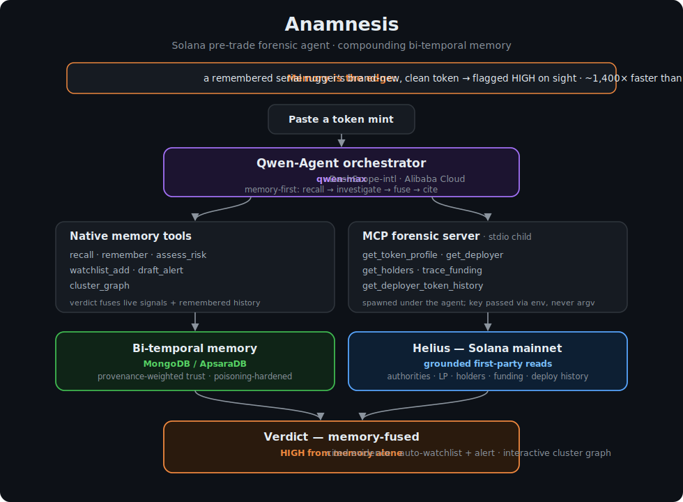

# Anamnesis

> A **Solana pre-trade forensic agent with compounding memory.** Paste a token mint; it investigates the deployer, funding trail, liquidity, and holder concentration — and because it *remembers every deployer it has ever seen* in a provenance-tracked, bi-temporal knowledge graph, a serial rugger's brand-new token gets flagged **on sight**, with the receipts.

*Anamnesis* (Greek: "recollection / un-forgetting"; in medicine, a patient's recalled case history) — the agent compiles the case history of every deployer and never forgets it.

<p align="center"></p>

| | |
|---|---|
| **Hackathon** | Global AI Hackathon with Qwen Cloud (Devpost) — **MemoryAgent** track |
| **Stack** | Python 3.12 · Qwen-Agent · `qwen-max` (DashScope-intl) · MCP · Helius · MongoDB / ApsaraDB · Alibaba Cloud |
| **Status** | Phase A + B complete · **234 tests** green · agent verified live end-to-end |

---

## The differentiator is memory, not detection

Existing on-chain AI tools query **statelessly**: every token is investigated cold, and a wallet that rugged ten tokens last month looks exactly as innocent as a first-time deployer. Anamnesis builds a private forensic memory that **compounds across sessions** — so it gets measurably sharper at catching repeat-offender deployers, and it does so even when a token's *current* on-chain state looks pristine.

> **Live example** (the demo, reproducible via `scripts/seed_demo.py`):
> A real serial rugger — `sF2ww…` — has launched 13 tokens, nearly all dead. Anamnesis remembers three of them rugging. Ask it about that deployer's **newest** token, `GYaS…` — which on its *own* live signals scores **LOW (0.2)** (renounced authorities, looks clean) — and the verdict is **HIGH (0.85)**:
>
> *"I have seen the deployer of this token rug three tokens before … the risk is HIGH, regardless of its current on-chain state."*
>
> Recalling that deployer's rug history from memory takes **~181 ms**; re-deriving it cold by scanning all 13 mints on-chain takes **~258 s** — **≈1,400× faster**, and the cold path is exactly the work memory lets you skip.

## How it works

1. **Memory first.** Before judging anything, the agent `recall`s what it already knows about the token **and its deployer**. Past behaviour is the strongest signal.
2. **Investigate, then decide.** `assess_risk(mint)` resolves the deployer from a grounded Helius read, fuses the live on-chain signals (authorities, LP securedness across 5 venues, holder concentration, funding trail) with the deployer's **remembered** history, and returns a cited verdict. Memory alone can drive a verdict to HIGH.
3. **Act.** At HIGH it auto-watchlists the deployer (so every *future* token they launch is flagged) and drafts a pending, human-reviewable alert — never auto-sent.
4. **Show the cluster.** `cluster_graph(deployer)` renders an interactive relationship graph; rugs and watchlisted tokens light up.

### Memory you can't poison

Memory an adversary can write to is a liability, not an asset. Anamnesis weighs every remembered fact by **how it was learned** — the one axis an attacker can't forge:

- `first_party` — the agent's own grounded on-chain observation. Authoritative; only this can reach HIGH.
- `derived` — its own inference. Corroborating, capped at MEDIUM.
- `claimed` — an external / second-hand breadcrumb. Context only; **can never raise a verdict, at any volume.**

The agent stamps `first_party` solely on its own Helius read. The `remember` tool — the one a prompt-injection could reach — **forces `claimed`**, so planted breadcrumbs add context but can never forge a rug or move a verdict. Risk comes only from *distinct first-party rugged tokens*; guilt-by-association is capped at MEDIUM however many links accrue.

### Bi-temporal by design

Every fact carries two independent clocks — **valid time** (when it was true on-chain) and **transaction time** (when the agent learned it) — so you can ask *"what did we know, and when?"* `recall(entity, as_of=…)` replays memory as of any past moment: as of last week the deployer had one known rug; today, three.

## Built on Alibaba Cloud + Qwen

- **`qwen-max`** drives the agent, via the DashScope **international** OpenAI-compatible endpoint — an Alibaba Cloud model API.
- **Qwen-Agent** is the runtime: it hosts the native memory tools and spawns the forensic **MCP** server as a stdio child (the Helius key is passed via the child's `env` block, never argv).
- **ApsaraDB for MongoDB** is the memory store the bi-temporal graph runs on, proven identical against an in-memory fake and a real Mongo via a cross-backend contract suite.

## The forensic toolset

| Native memory tools | MCP forensic reads (Solana, live via Helius) |
|---|---|
| `recall` · `remember` · `assess_risk` | `get_token_profile` · `get_deployer` |
| `watchlist_add` · `draft_alert` · `list_pending_alerts` | `get_holders` · `trace_funding` |
| `cluster_graph` | `get_deployer_token_history` |

LP-securedness is detected across **5 venues** (Raydium V4 / CPMM, Meteora DAMM v1, PumpSwap, pump.fun bonding curve) with tri-state burn / lock evidence.

## Quickstart

```bash
# 1. Configure (never commit real values — .env is gitignored)
cp .env.example .env        # fill ANAMNESIS_DASHSCOPE_API_KEY, ANAMNESIS_HELIUS_API_KEY, ANAMNESIS_MONGODB_URI

# 2. Install
python -m venv .venv && . .venv/bin/activate
pip install -e .

# 3. (Demo) seed the reproducible serial-rugger memory, then launch the WebUI
PYTHONPATH=src python scripts/seed_demo.py     # idempotent; --reset to start clean, --metric for the N× number
python app.py                                  # Qwen-Agent WebUI; click the GYaS suggestion → instant HIGH

# 4. Tests
pip install -e ".[dev]"
pytest -q                                      # 232 passing
ruff check src tests
```

## Design & docs

- [`SPEC.md`](./SPEC.md) — scope and acceptance criteria · [`PLAN.md`](./PLAN.md) — build plan
- [`docs/design/`](./docs/design) — per-feature design docs · [`docs/plans/`](./docs/plans) — implementation plans
- [`docs/runbooks/access-gates.md`](./docs/runbooks/access-gates.md) — access / config runbook

## License

MIT — see [`LICENSE`](./LICENSE). Forensic, provenance-grounded analysis — **not financial advice.**
